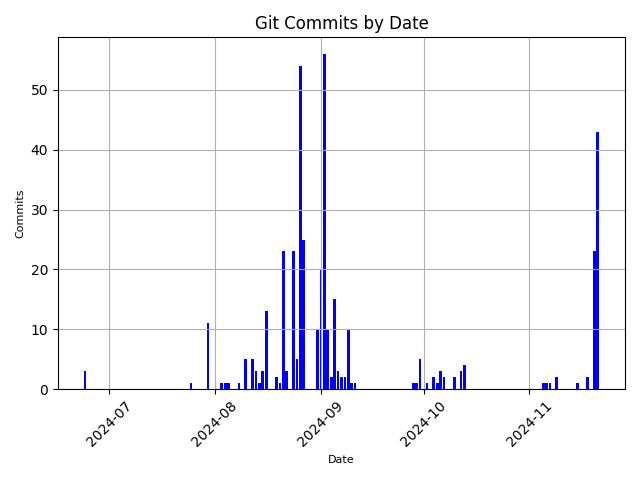

# git-commits-by-date
Git Commits by Date

## Setup

```bash
pipenv shell
```

```bash
pipenv sync --dev
```

## Create daily_commits.csv

```bash
git --no-pager log --shortstat --pretty=format:'%ad' --date=short \
| grep -E '^[0-9]{4}-[0-9]{2}-[0-9]{2}$' \
| uniq -c \
| awk -v 'OFS=,' '{print $1,$2}' > daily_commits.csv
```

## Create graph.png

```bash
python run.py
```

<div align="center">
  
</div>

<div align="center">
  
</div>
